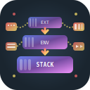

<div align="center">



# 🏗️ Stackbuilder

[](LICENSE-APACHE)
[](LICENSE-MIT)
[](https://www.rust-lang.org)

</div>

A powerful CLI tool for building Docker Compose files from modular components. Stackbuilder enables you to create maintainable, scalable Docker environments by assembling base components with environment-specific configurations and optional extensions.

## ✨ Key Features

- 🧩 **Modular Architecture** - Compose Docker environments from reusable components
- 🌍 **Multi-Environment Support** - Deploy to development, staging, production with ease
- 🔌 **Extension System** - Add features like monitoring, authentication, logging as needed
- 🎯 **Named Combos** - Define reusable extension combinations for consistency
- 📦 **Smart File Management** - Intelligent merging of configurations and environment files
- ⚡ **Fast Builds** - Efficient assembly with intelligent cleanup and preservation
- 🔧 **Flexible Configuration** - TOML-based configuration with sensible defaults

## ⚡ Quick Start

Get up and running in 3 simple steps:

```bash
# 1. Install stackbuilder
cargo install stackbuilder

# 2. Navigate to your project with components
cd your-project

# 3. Build your stack
stackbuilder
```

Your assembled Docker Compose files will be generated in the `./build` directory!

## 📦 Installation

### From Cargo (Recommended)

```bash
cargo install stackbuilder
```

### From Source

```bash
git clone https://github.com/zyrakq/stackbuilder.git
cd stackbuilder
cargo build --release
./target/release/stackbuilder --help
```

## 🎮 Basic Usage

### Project Structure

Organize your Docker components in this structure:

```sh
your-project/
├── stackbuilder.toml          # Configuration file
├── components/
│   ├── base/                  # Core services (required)
│   │   └── docker-compose.yml
│   ├── environments/          # Environment-specific configs
│   │   ├── dev/
│   │   │   └── docker-compose.yml
│   │   └── prod/
│   │       └── docker-compose.yml
│   └── extensions/            # Optional features
│       ├── monitoring/
│       │   └── docker-compose.yml
│       └── auth/
│           └── docker-compose.yml
└── build/                     # Generated output (auto-created)
```

### Configuration Examples

#### Basic Configuration (`stackbuilder.toml`)

```toml
[build]
environments = ["dev", "prod"]
extensions = ["monitoring", "auth"]
```

#### Advanced Configuration with Named Combos

```toml
[build]
# Define reusable extension combinations
combos = {
    security = ["auth", "guard"],
    observability = ["monitoring", "logging"]
}

# Use new targets configuration
[build.targets]
environments = ["dev", "staging", "prod"]

[build.targets.dev]
extensions = ["debugging"]
combos = ["security"]

[build.targets.prod]
combos = ["security", "observability"]
```

## 📁 Example Walkthrough

This repository includes several example configurations:

### 🔰 Basic Example (`examples/basic/`)

Simple setup with two environments and authentication extensions:

```bash
cd examples/basic
stackbuilder
```

**What it demonstrates:**

- Base component with core services
- Two environments: `devcontainer` and `internal`
- Extensions: `oidc` and `guard` for authentication
- Generated structure in `build/` directory

### 🎯 Complex Example (`examples/complex/`)

Multi-environment production setup:

```bash
cd examples/complex
stackbuilder
```

**What it demonstrates:**

- Three environments: `development`, `staging`, `production`
- Multiple extensions: `monitoring`, `logging`, `auth`, `backup`
- Environment-specific configurations
- Production-ready deployment structure

### 🛠️ Custom Paths Example (`examples/custom-paths/`)

Using custom directory structure:

```bash
cd examples/custom-paths
stackbuilder
```

**What it demonstrates:**

- Custom component directory names
- Non-standard project layout
- Flexible path configuration

### 🎨 Named Combos Example (`examples/named-combos/`)

Advanced extension management with named combinations:

```bash
cd examples/named-combos
stackbuilder
```

**What it demonstrates:**

- Named combo definitions
- Reusable extension groups
- Per-environment combo assignments

## 🚀 How It Works

1. **Component Assembly** - Stackbuilder reads your component structure
2. **Configuration Parsing** - Processes `stackbuilder.toml` for build rules
3. **Docker Compose Merging** - Intelligently combines YAML files
4. **Environment File Merging** - Merges `.env.example` files with priority
5. **Additional File Copying** - Copies configs, scripts, and certificates
6. **Smart Cleanup** - Preserves existing `.env` files during rebuilds

## 🔗 Docker Stack Collection

Stackbuilder is used extensively in practical deployment examples. Check out the [docker-stack-collection](https://github.com/zyrakq/docker-stack-collection) repository for real-world stack configurations and deployment patterns using stackbuilder.

## 📚 Documentation

- **[Configuration Reference](docs/config.md)** - Complete TOML configuration specification
- **[Testing Report](docs/testing-report.md)** - Comprehensive test coverage details

## 🤝 Contributing

We welcome contributions! Please feel free to:

1. **Report Issues** - Found a bug? [Open an issue](https://github.com/zyrakq/stackbuilder/issues)
2. **Submit PRs** - Improvements and new features are welcome
3. **Share Examples** - Add your stackbuilder configurations to help others
4. **Improve Documentation** - Help make our docs even better

## 📄 License

This project is dual-licensed under:

- [Apache License 2.0](LICENSE-APACHE)
- [MIT License](LICENSE-MIT)

You may choose either license for your use.

---

**Built with ❤️ in Rust** | **Perfect for DevOps teams and Docker enthusiasts**
